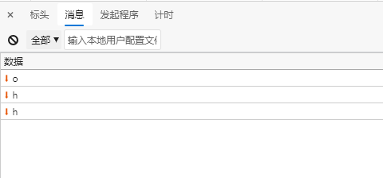
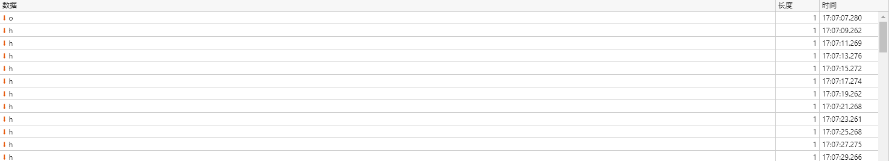
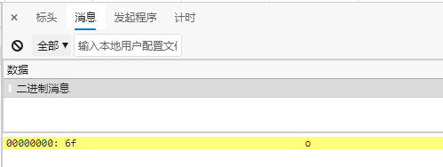
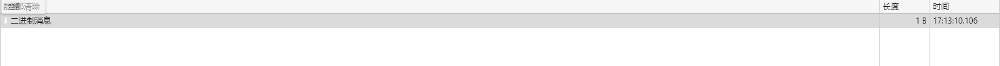
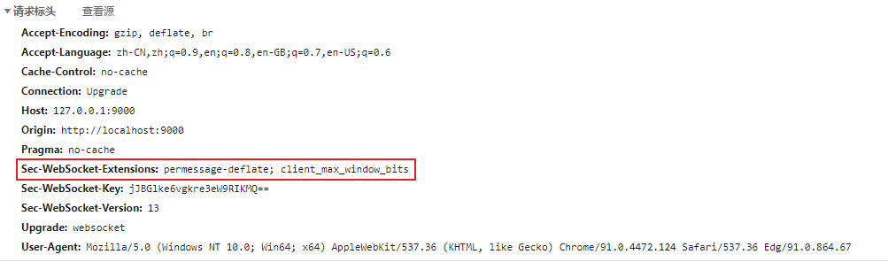

# simple-nginx
简单的 nginx `kotlin` 实现，参考 [aruis/geekwalk](https://github.com/aruis/geekwalk)

## 压力测试

- 上：nginx
- 下：simple-nginx 代理


关于控制台报错问题:


压测工具指定了测试时间，在到达指定的测试时间时，未响应的请求将被主动放弃，这些请求内，vertx 将响应数据写回时，但是连接已经被关闭，导致报错。

在 nginx 进行压测后，查看日志，也会发现在结束压测的时间点，存在部分请求响应 499。


## 部分差异及完善


在实现的过程中，发现 `geekwalk` 项目中一点不完善的地方，本项目进行了额外的补充和完善，主要有以下内容:

### 1. 静态资源代理

在 `vertx` 中，路径的匹配是根据配置路径的内容来进行的。

如 `/root`，将匹配到 `/root?a=1&...`，而 `/root/index.html` 是无法匹配到的，所以对于静态资源的代理，应该使用 `/root/*` 的路径进行配置。

在直播过程中，配置使用了 `"prefix": "/web1"` 的形式，且仅测试请求了 `/web1`，项目中并没有这个资源，因此等于跳转访问了 `/web1/index.html`，所以测试通过。

但实际上，这样配置及代码的逻辑仅能访问到 `/web1`，其内的其它资源是不能访问到的。

### 2. webSocket 代理

在直播及测试中，都使用了这个配置:
```json
{
  "prefix": "/",
  "upstream": "http://127.0.0.1:8080/"
}
```
而拷贝的前端 `webSocket` 的例子，实际上测试的是 `eventBus`，在 html 文件内，引入了 `vertx-eventbus.js` 依赖: 
```html
<script src="node_modules/vertx3-eventbus-client/vertx-eventbus.js"></script>
```
这个依赖会向后台发送请求获取 `eventBus` 信息: 


在代理请求后，依旧发送 `/eventbus` 去获取 `eventBus` 信息，由于使用 `/` 作为代理路径，请求被代理转发了，而实际上，如果代理路径不为 `/`，这个请求将会发送给代理，等于向代理获取 `eventBus` 信息。

因此，在本项目内，使用了原始的 `webSocket` 进行测试。

**~~`requestHandler` 只处理 `http` 请求，实际上不应该在 `requestHandler` 内来处理 `webSocket` 的建立。~~**

在 `vertx` 中，有两种处理 `webSocket` 的方式：

1. 提供 `webSocketHandler` 在服务示例上
2. 处理客户端发来的 `HTTP` 升级请求

它们之间的区别是，方式 2 可以绑定在一个端点上。

如果要代理 `sockjs`，`sockjs` 会自行处理绑定一个固定格式的端点，来处理 `webSocket` 方式的通信。如果在这之前，存在方式 1 的配置，那么其 `webSocket`  数据会优先通过协议传递至 `webSocketHandler` 进行处理，导致 `sockjs` 虽然可以成功连接到 `webSocket`(固定格式的)，但是却无法得到其返回的心跳，从而使用 `HTTP/HTTPS` 的方式进行通信。

因此，在需要处理多个端点的 `webSocket` 时，最好全部通过 方式 2 来处理。

### 3. webSocket 代理之间的通信

`WebSocket` 自身实现了 `ReadStream` 和 `WriteStream` 接口，因此它会有 `pipeTo` 方法使用管道来传递数据。

但是，当把 `webSocket` 当作 `ReadStream` 或 `WriteStream` 使用时，只能用于WebSocket连接，这些连接使用的是二进制帧, 没有分裂到多个帧。而 `webSocket` 报文是分帧传输的，不能主动将帧进行合并, 因为有时候它们可能代表着特殊的意义。

当使用 `pipeTo` 来传递客户端与服务端之间的 `WebSockt` 数据时，如果使用 `sockjs`，会发现 `sockjs` 虽然会成功的连接到了 `webSocket`，但是它依旧使用 `HTTP/HTTPS` 的方式进行通信。如果对比直接和使用代理的两种情况下，`webSocket` 内的通信数据，会发现，正常情况下服务端应该会返回



其中，h 以固定间隔由服务端向浏览器发送，并且这些标志的大小均为 1



而使用 `pipeTo` 来桥接后，返回



它的长度为 `1B`



随后，这个连接就被客户端终止了，使用 `HTTP/HTTPS` 的方式进行通信。

很明显，这里的数据应该以单独的帧被传递，不能被合并，根据 `vertx` 内 `WebSocket` 内容的文档，在处理 `webSocket` 代理之间的通信时，推荐使用帧处理。

### 4. webSocket 数据压缩

在客户端发起 `webSocket` 升级请求时，会携带这样一个请求头：



如果在代理内将这个请求头进行转发，则会产生以下错误：


经过排查，是因 `permessage-deflate` 导致的，该请求头为消息压缩请求扩展。使用 `vertx` 内 `HttpClient` 携带该请求头进行测试，会发生同样的错误。观察错误消息，它提示 `RSV`(`WebSocket`协议格式内的特殊标志) 不为 0，但是没有协商扩展。对于这种情况，暂时只能认定为 `vertx` 内 `HttpClient` 不支持消息压缩了，在代理 `webSocket` 时，暂不转发任何请求头（必要的请求头 `webSocket` 客户端会自动填写），在此配置上进行测试，`webSocket` 与 `sockjs` 均可以正常工作了。

### 5. 负载均衡

提供轮询、权重、随机三种负载均衡策略的实现。

### 6. 测试用例

完善了所有的测试用例（使用 `vertx` 推荐方式）。

### 7. 细节优化

优化多处逻辑实现细节。

