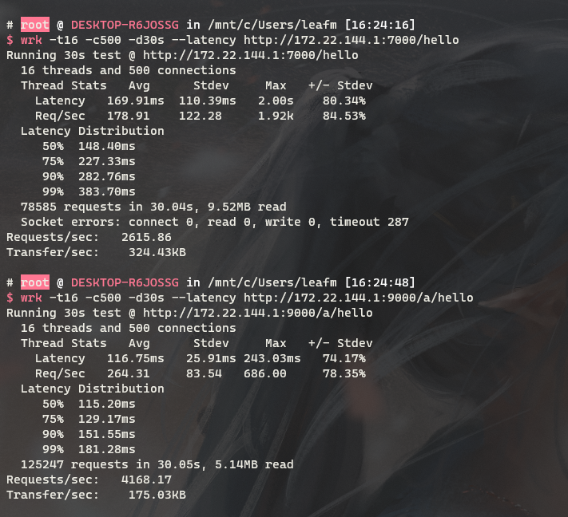
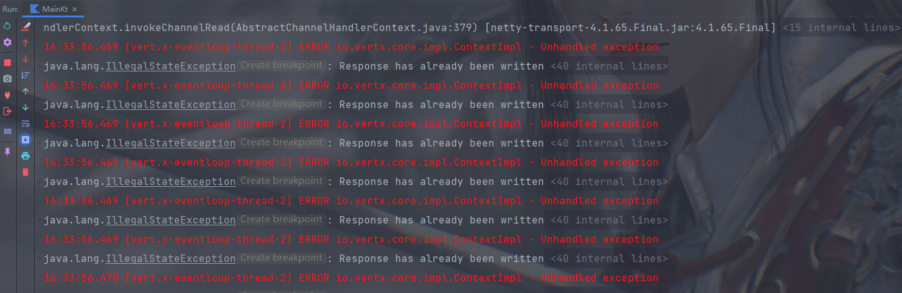
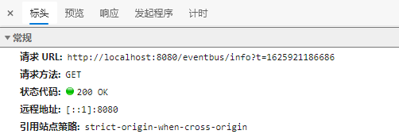

# simple-nginx
简单的 nginx `kotlin` 实现，参考 [aruis/geekwalk](https://github.com/aruis/geekwalk)

## 压力测试

- 上：nginx
- 下：simple-nginx 代理



关于控制台报错问题:



压测工具指定了测试时间，在到达指定的测试时间时，未响应的请求将被主动放弃，这些请求内，vertx 将响应数据写回时，但是连接已经被关闭，导致报错。

在 nginx 进行压测后，查看日志，也会发现在结束压测的时间点，存在部分请求响应 499。


## 部分差异及完善


在实现的过程中，发现一些 `geekwalk` 项目中不完善的地方，本项目进行了额外的补充和完善，主要有以下内容:

### 1. 静态资源代理

在 `vertx` 中，路径的匹配是根据配置路径的内容来进行的。

如 `/root`，将匹配到 `/root?a=1&...`，而 `/root/index.html` 是无法匹配到的，所以对于静态资源的代理，应该使用 `/root/*` 的路径进行配置。

在直播过程中，配置使用了 `"prefix": "/web1"` 的形式，且仅测试请求了 `/web1`，项目中并没有这个资源，因此等于跳转访问了 `/web1/index.html`，所以测试通过。

但实际上，这样配置及代码的逻辑仅能访问到 `/web1`，其内的其它资源是不能访问到的。

### 2. webSocket 代理

在直播及测试中，都使用了这个配置:
```json
{
  "prefix": "/"，  
  "upstream": "http://127.0.0.1:8080/"
}
```
而拷贝的前端 `webSocket` 的例子，实际上测试的是 `eventBus`，在 html 文件内，引入了 `vertx-eventbus.js` 依赖: 
```html
<script src="node_modules/vertx3-eventbus-client/vertx-eventbus.js"></script>
```
这个依赖会向后台发送请求获取 `eventBus` 信息: 




在代理请求后，依旧发送 `/eventbus` 去获取 `eventBus` 信息，由于使用 `/` 作为代理路径，请求被代理转发了，而实际上，如果代理路径不为 `/`，这个请求将会发送给代理，等于向代理获取 `eventBus` 信息。

因此，在本项目内，使用了原始的 `webSocket` 进行测试。

**`requestHandler` 只处理 `http` 请求，实际上不应该在 `requestHandler` 内来处理 `webSocket` 的建立。**
